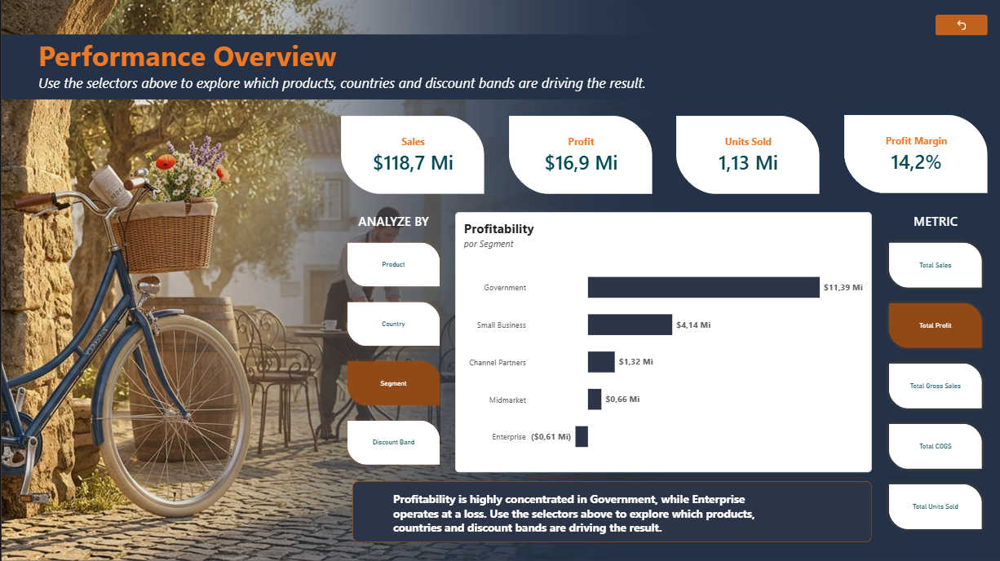
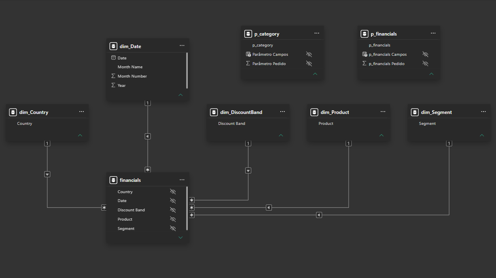

# Dynamis — Power BI Financial Analysis

Interactive financial performance analysis developed in Power BI, using a Star Schema and Field Parameters to enable dynamic exploration of business dimensions and financial metrics.

## 📊 Project Overview

This project was developed as a practical Power BI challenge focused on data modeling, financial KPIs, dynamic analysis and data storytelling.

The report transforms the Financials sample dataset into an interactive Executive Overview, allowing users to dynamically change the analytical dimension and financial metric through Field Parameters.

The objective is to demonstrate how a structured data model combined with dynamic analysis can transform raw financial data into actionable business insights.

---

## 🎯 Objectives

- Build a structured analytical model using Star Schema.
- Create financial KPIs for executive analysis.
- Implement Field Parameters based on business dimensions.
- Implement Field Parameters based on financial metrics.
- Create an interactive visual capable of changing its analysis dynamically.
- Apply data storytelling principles to present insights clearly.
- Develop a client-facing executive overview suitable for business analysis and decision support.

---

## 🖥️ Executive Overview

The report was designed as a client-facing executive page rather than a collection of isolated visuals.

The Executive Overview combines financial KPIs, dynamic Field Parameters and data storytelling to provide a concise view of business performance.

### Dashboard Preview



The analytical flow follows:

**Overall Performance → Profitability → Dimension Analysis → Interactive Exploration → Business Insight**

The initial view focuses on **Profit by Segment**, highlighting a strong concentration of profitability in the Government segment and a negative profit result in Enterprise.

The interactive selectors allow users to change both the analytical dimension and the financial metric without requiring multiple static visuals.

---

## 🧩 Data Model

The project uses a **Star Schema** consisting of one fact table and multiple dimension tables.

### Fact Table

**`financials`**

The fact table contains the quantitative business data used for financial analysis, including:

- Sales
- Gross Sales
- COGS
- Discounts
- Profit
- Units Sold
- Sale Price
- Manufacturing Price

### Dimension Tables

- `dim_Date`
- `dim_Product`
- `dim_Country`
- `dim_Segment`
- `dim_DiscountBand`

The dimension tables are connected to the `financials` fact table through one-to-many relationships.

### Star Schema



---

## 📈 Key Performance Indicators

The Executive Overview includes the following KPIs:

- **Sales**
- **Profit**
- **Units Sold**
- **Profit Margin**

These indicators provide a high-level view of financial performance before deeper exploration of the data.

---

## 🔄 Dynamic Analysis with Field Parameters

Two Field Parameters were implemented to allow users to dynamically explore the data.

### Category Parameter — `p_category`

The category parameter allows analysis by:

- Product
- Country
- Segment
- Discount Band

### Financial Metric Parameter — `p_financials`

The financial parameter allows users to switch between:

- Total Sales
- Total Profit
- Total Gross Sales
- Total COGS
- Total Units Sold

The two parameters work together, allowing combinations such as:

- Product × Sales
- Country × Profit
- Segment × Profit
- Discount Band × COGS
- Product × Units Sold

This approach provides analytical flexibility while reducing the need for multiple static visuals.

---

## 💡 Business Storytelling

The initial view of the Executive Overview focuses on **Profit by Segment**.

The analysis highlights:

- **Government** as the strongest profit-generating segment.
- **Enterprise** as the only segment presenting a negative profit result.
- A significant difference in profitability across business segments.

This leads to the initial business question:

> **Where is profitability being generated, and where are potential areas of concern?**

The Field Parameters then allow the user to investigate the result from different perspectives, including products, countries, segments and discount bands, while switching between financial metrics.

The dashboard therefore moves from a high-level view of performance to interactive exploration and business insight.

---

## 🛠️ Tools & Technologies

- **Power BI Desktop**
- **Power Query**
- **DAX**
- **Star Schema**
- **Field Parameters**
- **Data Modeling**
- **Financial KPIs**
- **Data Visualization**
- **Data Storytelling**

---

## 📁 Project Files

```text
dynamis-power-bi-financial-analysis/
│
├── dynamis.pbix
├── financials.xlsx
├── README.md
│
└── images/
    ├── executive-overview.png
    └── star-schema.png
```
## 📁 Project Files

- `dynamis.pbix` — Power BI report.
- `financials.xlsx` — source dataset.
- `images/executive-overview.png` — final Executive Overview dashboard preview.
- `images/star-schema.png` — Power BI data model documentation.

---

## 📌 Dataset

The project uses the standard **Financials sample dataset** commonly used for Power BI learning and demonstration purposes.

The dataset contains financial information across products, countries, segments, discount bands and monthly periods.

---

## 🎓 Project Context

This project was developed as part of a practical Power BI challenge focused on the application of concepts related to:

- Data modeling
- Field Parameters
- Financial analysis
- Interactive reporting
- Data storytelling
- Executive dashboards

The project extends the basic requirements of the challenge by structuring the data using a Star Schema and presenting the analysis through a client-oriented Executive Overview.

---

## 👤 Author

**Lucio Vale**

Power BI | Data Analytics | Business Intelligence

---

## 📄 License

This project is intended for educational and portfolio purposes.
